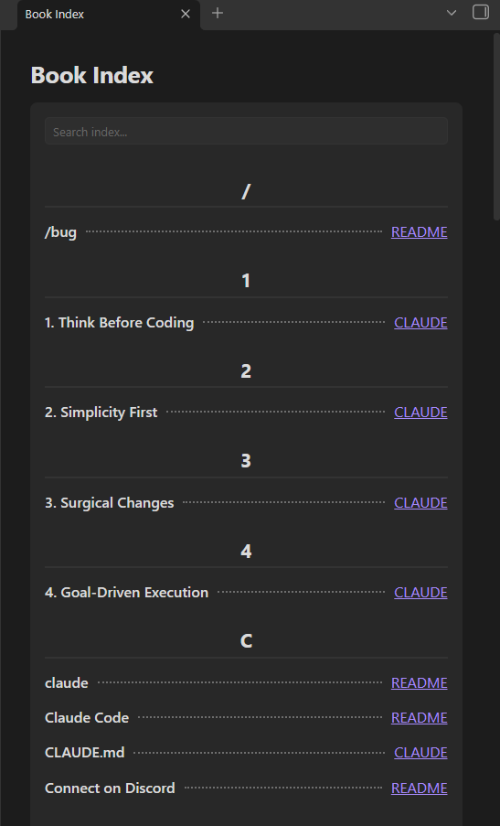
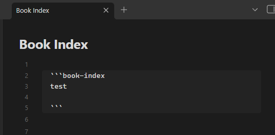

# Obsidian Book Index Plugin

Creates a beautiful, interactive "Book-like Index" for your Obsidian vault. 

This plugin automatically scans your vault and generates an alphabetized index of your most important terms, concepts, and keywords—just like the index at the back of a textbook! It completely automates the process of finding where terms are mentioned and links directly to the exact line in your notes.





## ✨ Features

- **Auto-Extraction Rules**: Automatically index important terms without typing them manually! The plugin can extract words from Headings, Bold/Italic text, and Code blocks across your entire vault.
- **Manual Indexing**: Define specific terms you want to track using a simple markdown code block.
- **Smart Relevance Scoring**: Files where a term appears in a Heading are ranked higher than files where it only appears in plain text.
- **Jump to Exact Line**: Clicking a link in the index doesn't just open the file—it scrolls your editor to the *exact line* where the word was found.
- **Live Search Filter**: A sticky search box at the top of the index allows you to instantly filter terms in real-time.
- **Customizable Multi-Column Grid**: Choose to display the file links in 1, 2, 3, or 4 columns to save vertical space. The grid smartly auto-shrinks and right-aligns when there are fewer links.
- **Word Wrap Support**: Long sentences (like full headings) are neatly wrapped and kept contained without overflowing your screen.

## 🚀 How to Use

To generate an index in any of your notes, simply create a `book-index` code block. 

### 1. Fully Automatic Indexing
If you have the **Auto-Extraction Rules** enabled in the plugin settings (they are on by default), you don't even need to type anything inside the block! Just place an empty block:

```markdown
`​`​`book-index
`​`​`
```
*(Remove the invisible spaces between the backticks when copying)*

The plugin will instantly scan your vault, extract all your bolded words, headings, and code snippets, and build a massive, alphabetized index linking back to every file.

### 2. Manual Term Tracking
If you want to track specific plain-text words that aren't bolded or in headings, simply list them inside the code block (one word per line):

```markdown
`​`​`book-index
Obsidian
knowledge management
Zettelkasten
`​`​`
```

The plugin will combine your manual words with the auto-extracted rules to build the final index.

## ⚙️ Settings & Rules

You can customize how the index is built by going to **Settings > Book Index**.

### Extraction Rules & Weighting
When a word is found in multiple files, the plugin sorts the links based on *Relevance Weight*:
- **Headings Rule (`#`, `##`, `###`)**: Automatically extracts headings to the index. Gives the highest weight **(+50)**.
- **Bold/Italic Rule (`**word**`, `*word*`)**: Automatically extracts emphasized text. Gives medium weight **(+30)**.
- **Code Blocks Rule (`word`, ```word```)**: Automatically extracts technical terms inside inline code. Gives base weight **(+20)**.

*Note: Plain text matches for manually typed words receive a base score of `1`.*

### UI & Formatting Settings
- **Trim Numbers & Special Characters**: Automatically removes leading and trailing numbers or punctuation from extracted words (e.g., `# 1. Topic` becomes `Topic`). This keeps your index incredibly clean!
- **Show Letter Headers**: Toggle the display of the alphabet headers (A, B, C...) above each index group. 
- **Number of Link Columns**: Choose how many columns (1 to 4) to display the file links on the right side. If an entry has fewer links than your selected columns, it will automatically shrink and right-align perfectly!

## 💡 Examples & Tips

### Example 1: The "Master Index" Note
Create a new note called `Master Index.md` and place the `book-index` block inside. Keep this note pinned or in your sidebar. Whenever you want to find a concept, open your Master Index, use the sticky search box at the top, and click the file link to jump straight to the relevant line!

### Example 2: Ignoring URLs
Don't worry about URLs messing up your index! The plugin has built-in smart filtering that ignores URLs. So if you have `_` inside a Google Drive link, it won't be accidentally extracted as italic text.

## ❤️ Support & Donate

If this plugin has improved your Obsidian workflow, saved you time, or you just want to support its continued development, please consider donating! 

Your support is incredibly appreciated, helps fix bugs, and keeps this project alive and growing. 🙏

https://buymeacoffee.com/endofday

<a href="https://www.buymeacoffee.com/endofday" target="_blank"></a>
---
**Built with ❤️ for the Obsidian Community**
